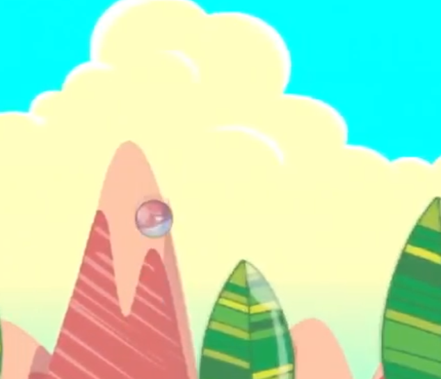

Flapping in the 90's is a game I designed to be a parody of the smash hit classic "flappy bird". It follows in the tropes of the genre, but eventually subverts those tropes when the game transforms into a hyperspeed sidescroller.

Flapping was constructed over two weeks for a freeform project requirement. It is built entirely in Java.

In this project I gained experience with game design & completion, and the process of designing and constructing a project from the ground up. 
